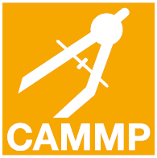
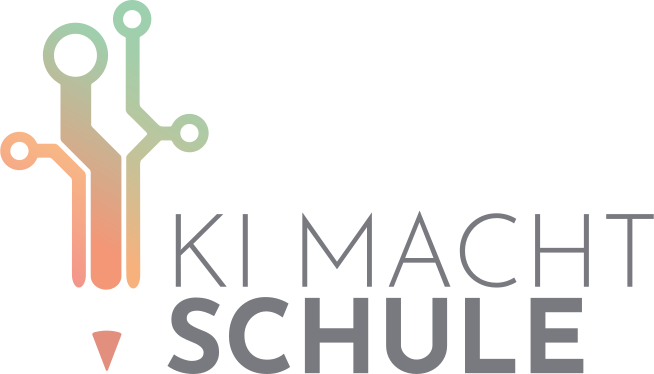

    

        

            
The symposium provides a platform to present and discuss ongoing research projects, findings, ideas and initiatives in the field of AI  education. It  provides opportunities to initiate new interdisciplinary projects.

        

    

{{% paige/image alt="Landscape" breakpoints=true class="object-fit-cover rounded-4" fetchpriority="high" height="20rem" loading="eager" process="webp" src="../assets/img/salzburg.png" width="100%" %}}
  

Image created with DreamStudio by stability.ai

 

<!-- Idea-->

Idea of the Symposium

AI technologies affect our daily lives and especially the lives of young people in almost all areas of life, and are predicted to do so even more in the future. Therefore, AI education should be discussed from different educational perspectives and implemented at an early stage. This should include promoting an understanding of how AI systems work, as well as their limitations, opportunities, risks and creative potential.

AI and Data science literacy are increasingly essential subjects that need to be addressed  in school curricula. In today’s digital age, data is being generated at an unprecedented rate. Thus, understanding how to analyze and interpret data is crucial to making  informed decisions in a variety of  fields. Data science literacy enables students to extract valuable insights from vast amounts of data and to make evidence-based decisions and solve complex problems. In addition, AI literacy is vital as AI becomes ubiquitous in our lives, influencing everything from the products we use to the way we work and live. Familiarity with AI concepts and applications enables students to understand and engage with the rapidly evolving technology landscape, fostering innovation and ensuring they can navigate the future with confidence and adaptability.  

This symposium aims to promote a broad understanding of the methodological foundations of AI and to equip individuals, especially students at school level, with the knowledge and skills needed to navigate effectively in the AI-driven world. It focuses on education for  learning AI and Data Science and the development of mathematical, statistical and computer science skills that can be associated with AI literacy. The mere use of AI technologies in an educational context is not the focus of the symposium.

<!-- Scientific Committee -->

Scientific Program Committee

 

  <ul>
    

  <ul>
    

      
      <a href="https://www.uni-paderborn.de/en/person/30619"><b>Susanne Podworny</b></a>
      
Paderborn University Co-Chair

    

    

      
      <a href="https://schoenbrodt.info/en"><b>Sarah Schönbrodt</b></a>
      
Salzburg University Co-Chair

    

    <!-- Add a line break -->
    

    

      
      <a href="https://www.uni-paderborn.de/person/16274"><b>Rolf Biehler</b></a>
      
Paderborn University 

    

    

      
      <a href="https://www.scc.kit.edu/personen/martin.frank.php"><b>Martin Frank</b></a>
      
KIT

    

    

      
      <a href="https://stes.io"><b>Steffen Schneider</b></a>
      
Helmholtz Munich

    

    

      
      <a href="https://www.uni-paderborn.de/person/60311"><b>Carsten Schulte</b></a>
      
Paderborn University

    

  </ul>

<!-- Add a line break -->

Related Projects

<spacer type=vertical size=1000>
 

  <ul>
    

      
    

    

      
    

    

      
    

  </ul>

